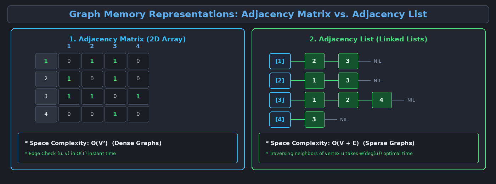
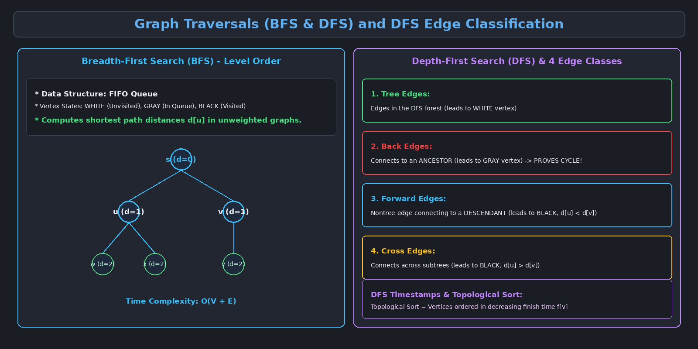

This topic covers graph memory representations, Breadth-First Search (BFS), Depth-First Search (DFS), edge classifications, Directed Acyclic Graphs (DAGs), Topological Sorting, and Strongly Connected Components (SCC).

---

# 1. Graph Representations: Matrix vs. List

To process graphs algorithmically, they must be stored efficiently in computer memory using one of two standard representations:



### Representation Comparison:

| Criteria | Adjacency Matrix | Adjacency List |
| :--- | :--- | :--- |
| **Data Structure** | 2D Array $A[|V| \times |V|]$ | Array of $|V|$ singly linked lists |
| **Space Complexity** | $\Theta(V^2)$ (Fixed memory) | $\Theta(V + E)$ (Proportional to edges) |
| **Check if $(u, v) \in E$** | $\Theta(1)$ (Instant lookup) | $O(\deg(u))$ (Traverse linked list) |
| **List all neighbors of $u$** | $\Theta(V)$ (Must scan entire row) | $\Theta(\deg(u))$ (Optimal) |
| **Optimal Use Case** | **Dense Graphs** ($|E| \approx |V|^2$) | **Sparse Graphs** ($|E| \ll |V|^2$) |

---

# 2. Breadth-First Search (BFS)

**Breadth-First Search** systematically explores the graph in concentric "waves" or levels starting from a source vertex $s$.

### 2.1 The 3-Coloring State Convention:
- **`WHITE` (Unvisited):** Vertex has not yet been discovered.
- **`GRAY` (Discovered / In Queue):** Vertex has been discovered, but its neighbors have not yet all been inspected.
- **`BLACK` (Explored):** Vertex has been fully inspected and all its neighbors added to the queue.

### 2.2 Maintained Vertex Attributes:
- $color[u]$: Current exploration color state (`WHITE`, `GRAY`, `BLACK`).
- $d[u]$: Shortest path distance (minimum edge count) from source $s$ to vertex $u$.
- $\pi[u]$: Predecessor (parent) pointer in the resulting **BFS Tree**.

### 2.3 BFS Pseudocode & Mechanics:
```python
def BFS(G, s):
    for u in G.V - {s}:
        color[u] = WHITE
        d[u] = infinity
        pi[u] = NIL
    
    color[s] = GRAY
    d[s] = 0
    pi[s] = NIL
    
    Q = Queue()
    Q.enqueue(s)
    
    while not Q.isEmpty():
        u = Q.dequeue()
        for v in G.Adj[u]:
            if color[v] == WHITE:
                color[v] = GRAY
                d[v] = d[u] + 1
                pi[v] = u
                Q.enqueue(v)
        color[u] = BLACK
```

> [!note] BFS Key Properties
> - **Total Time Complexity:** $O(V + E)$
> - **Shortest Path Property:** BFS guarantees finding the minimum number of edges from source $s$ to all reachable vertices in unweighted graphs.

---

# 3. Depth-First Search (DFS)

**Depth-First Search** explores as deeply as possible along each branch before backtracking, utilizing recursion or a LIFO stack.

### 3.1 DFS Timestamps:
DFS records two chronological timestamps for each vertex $u$ using a global counter `time`:
- **Discovery Time ($d[u]$):** The timestamp when vertex $u$ is first discovered (turns `GRAY`).
- **Finish Time ($f[u]$):** The timestamp when all adjacent neighbors of $u$ have been fully explored (turns `BLACK`).

$$\forall u \in V: \quad 1 \le d[u] < f[u] \le 2|V|$$

### 3.2 The Parenthesis Theorem:
In any DFS of graph $G$, for any two vertices $u$ and $v$, exactly one of the following holds:
1. Intervals $[d[u], f[u]]$ and $[d[v], f[v]]$ are **completely disjoint** (neither is an ancestor of the other).
2. Interval $[d[u], f[u]]$ is **entirely nested** inside $[d[v], f[v]]$ ($u$ is a descendant of $v$).
3. Interval $[d[v], f[v]]$ is **entirely nested** inside $[d[u], f[u]]$ ($v$ is a descendant of $u$).

---

# 4. DFS Edge Classification (Directed Graphs)

During a DFS traversal of a directed graph, every edge $(u, v)$ is classified into one of four categories based on the color of vertex $v$ at the time the edge is first explored:



1. **Tree Edges:** Edges belonging to the DFS forest (leads to a `WHITE` vertex).
2. **Back Edges:** Edges connecting vertex $u$ to an ancestor $v$ in a DFS tree (leads to a `GRAY` vertex). 
   - *Key Theorem: A directed graph contains a cycle if and only if DFS produces at least one Back Edge.*
3. **Forward Edges:** Non-tree edges connecting vertex $u$ to a descendant $v$ in a DFS tree (leads to `BLACK` vertex where $d[u] < d[v]$).
4. **Cross Edges:** Edges connecting vertices across subtrees or components (leads to `BLACK` vertex where $d[u] > d[v]$).

---

# 5. Topological Sort (DAGs)

A **Directed Acyclic Graph (DAG)** is a directed graph containing zero directed cycles.

> [!important] Definition: Topological Sort
> A **Topological Sort** of a DAG $G = (V, E)$ is a linear ordering of all its vertices such that if $G$ contains an edge $(u, v)$, then $u$ appears before $v$ in the ordering.

> **Example DAG:** `[Wear Shirt]` $\longrightarrow$ `[Wear Tie]` $\longrightarrow$ `[Wear Jacket]`  
> **Linear Valid Order:** `Shirt` $\to$ `Tie` $\to$ `Jacket`

### Topological Sort Algorithm:
1. Run `DFS(G)` to compute finish times $f[v]$ for all vertices.
2. As each vertex is finished (turned `BLACK`), insert it onto the front of a linked list.
3. Return the linked list of vertices (ordered in **decreasing order of finish times $f[v]$**).

$$\text{Time Complexity: } \Theta(V + E)$$

---

# 6. Strongly Connected Components (SCC)

A **Strongly Connected Component** of a directed graph $G = (V, E)$ is a maximal set of vertices $C \subseteq V$ such that every vertex in $C$ can reach every other vertex in $C$ ($u \leadsto v$ and $v \leadsto u$ for all $u, v \in C$).

### Kosaraju-Sharir Algorithm for SCC:
1. Call `DFS(G)` to calculate finish times $f[u]$ for every vertex $u \in V$.
2. Compute the **Transpose Graph $G^T = (V, E^T)$** by reversing all edge directions.
3. Call `DFS(G^T)`, considering vertices in order of **decreasing finish times** computed in Step 1.
4. Output the vertices in each tree of the resulting DFS forest as a separate Strongly Connected Component.

$$\text{Time Complexity: } \Theta(V + E)$$
