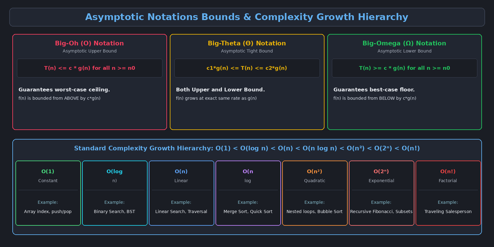

This topic covers the mathematical and theoretical framework for analyzing algorithm efficiency, instruction counting using the Sequential Computational Model, and establishing growth boundaries using Asymptotic Notations (Big-O, Big-Omega, Big-Theta).

---

# 1. Complexity Trade-offs: Time vs. Space

Designing algorithms is fundamentally about making engineering decisions, and algorithmic decisions always involve **trade-offs** between **Time Complexity** (how fast it runs) and **Space Complexity** (how much RAM it consumes).

### The Grocery Shopping Analogy
- **Time-Efficient Strategy (Lower Time, Higher Space):** Drive a large truck to the supermarket and purchase an entire month’s groceries in one trip. The task is completed quickly, but requires a large vehicle (higher space).
- **Space-Efficient Strategy (Lower Space, Higher Time):** Walk to the grocery store with a small tote bag. You only use a small bag, but you must make 20 trips back and forth, consuming vastly more time.

In computer systems, we constantly balance whether to cache/store intermediate data in memory to execute faster, or re-compute values on the fly to save memory.

---

# 2. The Sequential Computational Model

To evaluate algorithm efficiency objectively without hardware or compiler bias, computer science relies on an idealized theoretical model called the **Sequential Computational Model**.

### Core Axiomatic Assumptions:
1. **Sequential Execution:** Instructions execute one by one in strict chronological order.
2. **Infinite Memory:** The computer has an arbitrarily large memory space with uniform access time.
3. **Unit Cost Per Simple Operation:** Basic operations each take exactly **one unit of time ($1$)**:
   - Variable assignment ($x = 5$)
   - Arithmetic operations ($+$, $-$, $*$, $/$, $\%$)
   - Logical/relational comparisons ($<$, $>$, $==$, $\le$, $\ge$)
   - Array indexing and pointer dereferencing ($A[i]$)
   - Function call/return overheads

---

# 3. Exact Code Instruction Counting

By applying unit costs, we can construct exact mathematical equations $T(n)$ for code fragments.

### 3.1 Sequential Statements
```c
sum = 0;              // Cost: 1
sum = sum + next;     // Cost: 1
```
$$\text{Total Cost } T = 1 + 1 = 2$$

---

### 3.2 Single Loop Execution
```c
for (int j = 0; j < n; j++) {     // Loop header
    sum = sum + a[j];             // Loop body
}
```

#### Step-by-Step Instruction Derivation:
- **Initialization (`int j = 0`):** Executes **$1$ time** at loop entry.
- **Condition Check (`j < n`):** Evaluates true $n$ times, and false $1$ time (to exit). Total = **$n + 1$ times**.
- **Increment (`j++`):** Executes at the end of every successful iteration. Total = **$n$ times**.
- **Loop Body (`sum = sum + a[j]`):** Executes once per iteration. Total = **$n$ times**.

$$\text{Loop Header Cost} = 1 + (n + 1) + n = 2n + 2$$
$$\text{Loop Body Cost} = n$$
$$\text{Total Time } T(n) = (2n + 2) + n = 3n + 2$$

---

### 3.3 Nested Loops Analysis
```c
for (int i = 0; i < n; i++) {           // Outer loop
    for (int j = 0; j < n; j++) {       // Inner loop
        k = k + 1;                      // Nested body
    }
}
```

- **Outer Loop Header:** Runs $2n + 2$ operations.
- **Inner Loop Header:** The header $(2n + 2)$ executes $n$ times: $n(2n + 2) = 2n^2 + 2n$.
- **Inner Body (`k = k + 1`):** Executes $n \times n = n^2$ times.

$$\text{Total Time } T(n) = (2n + 2) + (2n^2 + 2n) + n^2 = 3n^2 + 4n + 2$$

---

# 4. Complexity Analysis of Linear Search

Consider the classic sequential search algorithm searching for key $x$ in array $A[0 \dots n-1]$:

```c
int i = 0;
while (i < n && A[i] != x) {
    i++;
}
if (i < n) return i;
else return -1;
```

> **Summary:** Best Case = $O(1)$, Worst Case ($3n+3$) = $O(n)$, Average Case (50% target distribution) = $O(n)$.

- **Best Case:** Target is found at index $0$ on the very first comparison. $T(n) = O(1)$.
- **Worst Case:** Target is at the very last index or not present at all. The loop runs all $n$ iterations: $T(n) = 3n + 3$.
- **Average Case:** Assuming a target is present with probability $p = 0.5$ and uniformly distributed across indices, the expected comparisons equate to $\approx \frac{3}{4}n$, yielding $O(n)$.

---

# 5. Polynomial Rate of Growth & Dominating Terms

As the input size $n$ approaches infinity ($n \to \infty$), lower-order terms and constant coefficients become completely insignificant compared to the highest-order term.

- **Dominance Demonstration for $T(n) = 3n^2 + 4n + 2$ when $n = 1,000$:**
  - $3(1,000)^2 = 3,000,000$ (**99.86%** of total time)
  - $4(1,000) = 4,000$ (**0.13%** of total time)
  - $2 = 2$ (**0.00006%**)

> [!important] The Dominance Principle
> The highest-power term **dominates ("swamps")** all other terms. When classifying complexity, we drop all lower-order terms and multiplicative constants.

---

# 6. Asymptotic Notations: $O$, $\Omega$, $\Theta$

Asymptotic notations provide a formal mathematical framework for classifying algorithm efficiency based on asymptotic bounds.



### 6.1 Big-Oh Notation ($O$) — Asymptotic Upper Bound
Formal Definition:

$$T(n) = O(g(n)) \iff \exists \; c > 0, n_0 > 0 \quad \text{such that} \quad 0 \le T(n) \le c \cdot g(n), \quad \forall n \ge n_0$$

- Describes the **guaranteed maximum** time an algorithm will take (Worst-Case ceiling).

---

### 6.2 Big-Omega Notation ($\Omega$) — Asymptotic Lower Bound
Formal Definition:

$$T(n) = \Omega(g(n)) \iff \exists \; c > 0, n_0 > 0 \quad \text{such that} \quad 0 \le c \cdot g(n) \le T(n), \quad \forall n \ge n_0$$

- Describes the **absolute minimum** time an algorithm must take (Best-Case floor).

---

### 6.3 Big-Theta Notation ($\Theta$) — Asymptotic Tight Bound
Formal Definition:

$$T(n) = \Theta(g(n)) \iff \exists \; c_1 > 0, c_2 > 0, n_0 > 0 \quad \text{such that} \quad c_1 \cdot g(n) \le T(n) \le c_2 \cdot g(n), \quad \forall n \ge n_0$$

- Valid if and only if $T(n) = O(g(n))$ **AND** $T(n) = \Omega(g(n))$. Represents an exact, tight asymptotic bound.

---

# 7. Mathematical Simplification Rules for Big-Oh

1. **Rule of Sums:** If $T_1(n) = O(f(n))$ and $T_2(n) = O(g(n))$, then $T_1(n) + T_2(n) = O(\max(f(n), g(n)))$.
2. **Rule of Products:** If $T_1(n) = O(f(n))$ and $T_2(n) = O(g(n))$, then $T_1(n) \cdot T_2(n) = O(f(n) \cdot g(n))$.
3. **Logarithmic Base Equivalence:** $\log_a(n) = \frac{\log_b(n)}{\log_b(a)} = \Theta(\log_b(n))$.
   - *Therefore, we ignore base numbers in Big-O:* $O(\log_2 n) = O(\log_{10} n) = O(\ln n) = O(\log n)$.
4. **Logarithmic Exponent Property:** $\log(n^k) = k \log n = O(\log n)$ (powers inside logs become multiplicative constants).
5. **Polynomial Exponents Cannot Be Ignored:** $O(n^2) \neq O(n^3)$.
6. **Exponential Bases Cannot Be Ignored:** $O(2^n) \neq O(3^n)$.

---

# 8. Standard Complexity Classes and Growth Hierarchy

| Complexity Class | Big-O Notation | Typical Example Algorithm |
| :--- | :--- | :--- |
| **Constant Time** | $O(1)$ | Array index access, push/pop on stack |
| **Logarithmic Time** | $O(\log n)$ | Binary Search, BST Search |
| **Linear Time** | $O(n)$ | Linear Search, Array traversal |
| **Linearithmic Time** | $O(n \log n)$ | Merge Sort, Quick Sort (average case), Heap Sort |
| **Quadratic Time** | $O(n^2)$ | Bubble Sort, Selection Sort, Insertion Sort, Nested loops |
| **Cubic Time** | $O(n^3)$ | Matrix Multiplication (standard), 3-nested loops |
| **Exponential Time**| $O(2^n)$ | Recursive Fibonacci, Generating all subsets, Tower of Hanoi |
| **Factorial Time** | $O(n!)$ | Traveling Salesperson Problem (brute force), Permutations |

$$\text{Growth Order: } O(1) < O(\log n) < O(n) < O(n \log n) < O(n^2) < O(n^3) < O(2^n) < O(n!)$$
