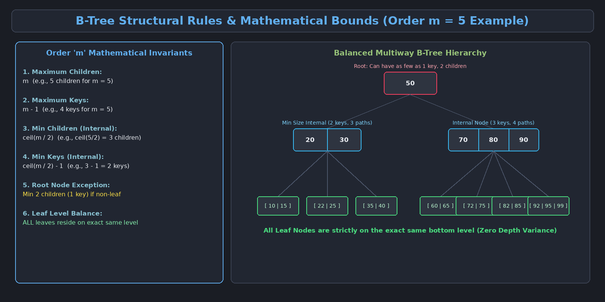
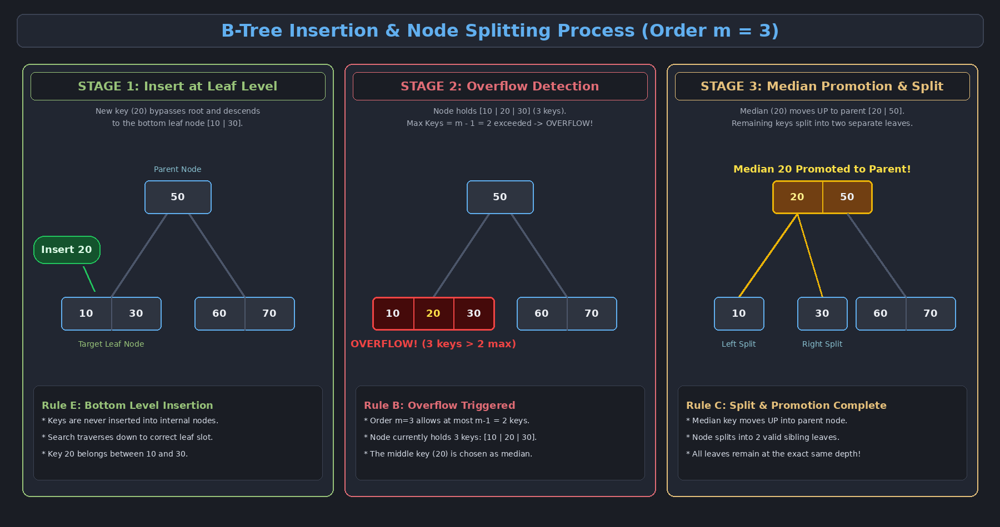
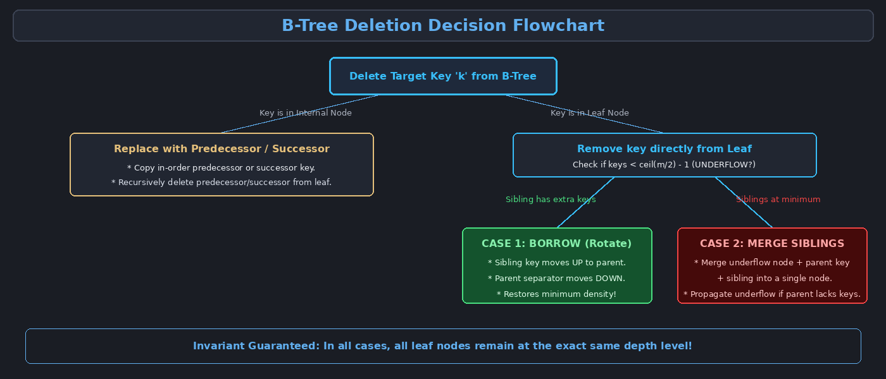

This topic covers multiway search trees, formal structural properties of B-Trees of Order $m$, searching, insertion mechanics with median promotion, deletion cases with borrowing and merging, and secondary storage optimization.

---

# 1. Motivation for B-Trees (Disk Storage Optimization)

Standard binary search trees (BSTs, AVL trees) work efficiently in main memory (RAM). However, when handling massive datasets that exceed RAM capacity and reside on **secondary storage (hard drives / SSDs)**, binary trees perform poorly:

- **Slow Disk Access (I/O):** Accessing data from a disk is several orders of magnitude slower than RAM access.
- **Excessive Height:** In a binary tree with $N$ elements, the height is $\approx \log_2 N$. Each level descent requires an independent disk read.
- **Block Transfer Unit:** Disk drives read and write data in fixed blocks or pages (e.g., 4KB or 8KB). A standard BST node stores only 1 key, wasting the rest of the transferred block.

> [!important] The B-Tree Solution
> A **B-Tree** is a self-balancing, **fat and shallow** multi-way search tree designed so that each node holds hundreds of keys and matches the exact size of a physical disk block, minimizing the number of disk I/O operations.

---

# 2. Structural Properties of a B-Tree of Order $m$

A B-Tree of **Order $m$** satisfies the following rigorous mathematical invariants:

1. **Max Children:** Every node has at most $m$ children.
2. **Max Keys:** Every node has at most $m - 1$ keys (keys act as separators between children).
3. **Min Children (Internal Nodes):** Every internal node (except the root) must have at least $\lceil m/2 \rceil$ children.
4. **Min Keys (Internal Nodes):** Every internal node (except the root) must have at least $\lceil m/2 \rceil - 1$ keys (the "half-full" density rule).
5. **Root Node Exception:** The root node has at least **$2$ children** (and at least **$1$ key**) if it is not a leaf.
6. **Leaf Level Uniformity:** All leaf nodes reside on the **exact same bottom depth level**.
7. **Sorted Keys:** All keys within any node are maintained in strictly ascending sorted order.

---

# 3. Searching in a B-Tree

Searching a B-Tree generalizes binary search to multiway branching:

1. Starting at the root, search the sorted keys within the current node (using linear or binary search).
2. If the target key is present in the node, search terminates successfully.
3. If not found, determine the unique child pointer interval between keys $[K_i, K_{i+1}]$ that bounds the target value.
4. Recursively repeat the search in the child subtree until the key is found or a null pointer (leaf boundary) is reached.

$$\text{Time Complexity: } O(\log_m n) \text{ disk accesses} = O(\log n) \text{ total CPU time}$$

---

# 4. Insertion in a B-Tree

Insertion always maintains the strict balance of the tree by inserting at the bottom and growing the tree **upwards**.

### The 4 Insertion Rules:
1. **Rule E (Bottom Level):** Insertion *always* begins at a leaf node.
2. **Rule A (Sorted Placement):** The new key is placed into the leaf node in its correct sorted order.
3. **Rule B (Overflow Detection):** If the number of keys exceeds the maximum capacity ($m - 1$), the node **overflows** and must split.
4. **Rule C (Median Promotion):**
   - The **median (middle) key** is promoted (moves up) to the parent node.
   - The remaining keys split into two new sibling nodes (left and right children).
   - If the parent node overflows as a result, the split cascades upward. If the root splits, a new root is formed, increasing the tree height by 1.

---

# 5. Deletion in a B-Tree

Deletion is more complex than insertion because removing a key must not violate the minimum density constraint ($\ge \lceil m/2 \rceil - 1$ keys).

### 5.1 Deleting from an Internal Node
- Find the key's **In-Order Predecessor** (largest key in the left subtree) or **In-Order Successor** (smallest key in the right subtree), which always resides in a leaf.
- Copy that predecessor/successor key into the target internal node.
- Recursively delete the predecessor/successor from the leaf node.

---

### 5.2 Deleting from a Leaf Node (Underflow Resolution)
If deleting from a leaf causes the node to have fewer than $\lceil m/2 \rceil - 1$ keys (**Underflow**):

1. **Case 1: Borrowing / Redistribution (Sibling has $> \text{minimum}$ keys):**
   - If an immediate sibling has extra keys, borrow a key by rotating through the parent node.
   - The parent key moves down into the underflowed node, and the sibling's boundary key moves up to the parent.

2. **Case 2: Merging (Immediate siblings are at exact minimum capacity):**
   - Combine the underflowed node, the separating key from the parent, and the sibling into a single node.
   - If the parent underflows as a result of losing its separator key, propagate the underflow resolution upward.
   - If the root loses its last remaining key, the root is deleted, and the merged child becomes the new root (height decreases by 1).

---

# 6. Summary of B-Tree Complexity & Applications

| Operation | Average Case | Worst Case | Disk Accesses |
| :--- | :--- | :--- | :--- |
| **Search** | $O(\log n)$ | $O(\log n)$ | $O(\log_m n)$ |
| **Insert** | $O(\log n)$ | $O(\log n)$ | $O(\log_m n)$ |
| **Delete** | $O(\log n)$ | $O(\log n)$ | $O(\log_m n)$ |

### Real-World Applications:
- **Relational Databases:** Primary and secondary indexing engines (MySQL InnoDB B+ Trees, PostgreSQL, SQLite, Oracle DB).
- **File Systems:** Directory and file allocation mapping (NTFS, ext4, Btrfs, HFS+).
- **Key-Value Stores:** Embedded storage engines (BerkeleyDB, RocksDB).
