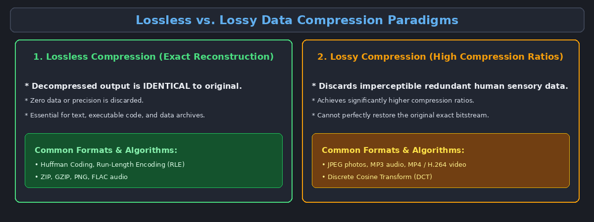
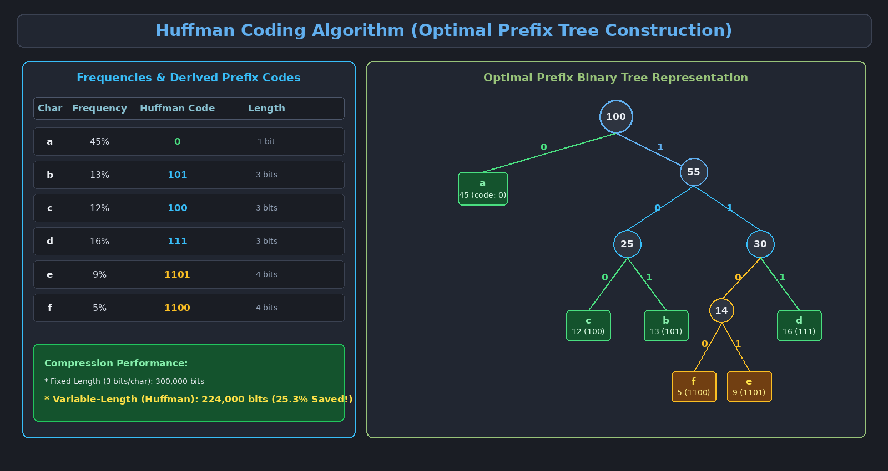

This topic covers lossless data compression principles, Fixed-Length vs. Variable-Length encodings, the Prefix Rule, Huffman Coding construction, and Run-Length Encoding (RLE).

---

# 1. Principles of Data Compression

**Data Compression** is the process of reducing the physical storage space and bandwidth required to store or transmit digital data by eliminating redundancy.

---

# 2. Fixed-Length vs. Variable-Length Encoding

Suppose we have a dataset of 100,000 characters consisting of only 6 unique characters ($a, b, c, d, e, f$):

| Character | Frequency (Count) | Fixed-Length Code | Variable-Length (Huffman) Code |
| :--- | :--- | :--- | :--- |
| **a** | 45,000 (45%) | `000` (3 bits) | `0` (1 bit) |
| **b** | 13,000 (13%) | `001` (3 bits) | `101` (3 bits) |
| **c** | 12,000 (12%) | `010` (3 bits) | `100` (3 bits) |
| **d** | 16,000 (16%) | `011` (3 bits) | `111` (3 bits) |
| **e** | 9,000 (9%) | `100` (3 bits) | `1101` (4 bits) |
| **f** | 5,000 (5%) | `101` (3 bits) | `1100` (4 bits) |

### Space Comparison:
- **Fixed-Length Total Bits:** $100,000 \times 3 = \mathbf{300,000 \text{ bits}}$.
- **Variable-Length Total Bits:** $(45 \times 1 + 13 \times 3 + 12 \times 3 + 16 \times 3 + 9 \times 4 + 5 \times 4) \times 1,000 = \mathbf{224,000 \text{ bits}}$.
- **Space Saved:** $\approx \mathbf{25.3\% \text{ reduction!}}$

---

# 3. The Prefix Rule (Prefix-Free Codes)

In a variable-length encoding scheme, how does the decoder know where one character ends and the next begins without delimiter characters?

> [!important] The Prefix-Free Rule
> A **Prefix Code** is a code in which **no codeword is a prefix of any other codeword**. 
> - For example, if `a` is encoded as `0`, no other character's code can begin with `0` (such as `01` or `001`).

### Binary Tree Representation:
Any prefix-free code can be mapped to a **Full Binary Tree**:
- Every character is located at a **leaf node**.
- Navigating **Left** represents bit `0`.
- Navigating **Right** represents bit `1`.
- Because characters reside exclusively in leaves, no character's path can be a prefix of another!

---

# 4. The Huffman Coding Algorithm

**Huffman Coding** is a greedy algorithm invented by David Huffman (1952) that constructs a mathematically optimal prefix tree for a given set of character frequencies.

### 4.1 Step-by-Step Construction Algorithm:
1. Initialize a **Min-Priority Queue (Min-Heap)** containing single-node trees for all unique characters, keyed by their frequency.
2. While the priority queue contains more than one node:
   - Extract the two nodes with the lowest frequencies, say $x$ and $y$.
   - Create a new internal parent node $z$ with frequency $f[z] = f[x] + f[y]$.
   - Set $x$ as the left child ($0$) and $y$ as the right child ($1$) of $z$.
   - Insert the new composite node $z$ back into the min-heap.
3. The remaining node in the queue becomes the root of the optimal **Huffman Tree**.
4. Read binary codewords by tracing root-to-leaf paths.

> **Time Complexity:** $O(n \log n)$ using a Min-Heap, where $n = |C|$ is the number of unique characters.

### 4.2 Calculating the Cost of a Huffman Tree:
The total number of bits required to encode a file $T$ is:

$$B(T) = \sum_{c \in C} \text{freq}(c) \cdot d_T(c)$$

where $d_T(c)$ denotes the depth (codeword length) of character $c$ in tree $T$.

---

# 5. Run-Length Encoding (RLE)

**Run-Length Encoding (RLE)** is a simple lossless data compression algorithm that replaces consecutive sequences of identical characters (runs) with the character and its frequency count.

- **Uncompressed Stream:** `A A A A A B B B B C C D D D D D D` (17 bytes)
- **RLE Compressed Stream:** `A5 B4 C2 D6` (8 bytes, **53% reduction**)

### Analysis of RLE:
- **Best-Case Scenario:** Long contiguous repeating sequences (e.g., `A` repeated 1000 times compresses from 1000 bytes down to `A1000` = 5 bytes).
- **Worst-Case Scenario (Data Expansion):** Highly alternating data with no consecutive repeats:
  - Original: `A B C D E` (5 bytes)
  - Encoded: `A1 B1 C1 D1 E1` (10 bytes $\to$ **100% size expansion!**)
- **Applications:** Fax transmission (CCITT standards), monochrome images, BMP and TIFF image run compression.
