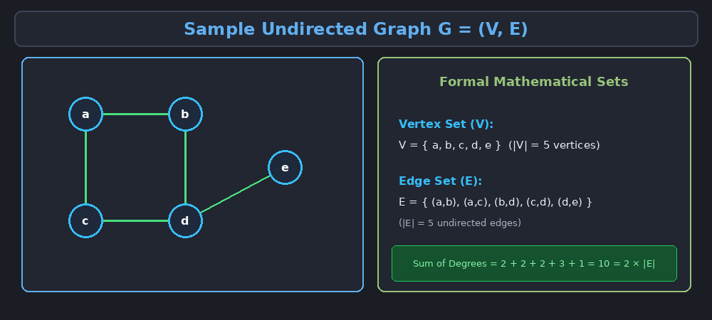
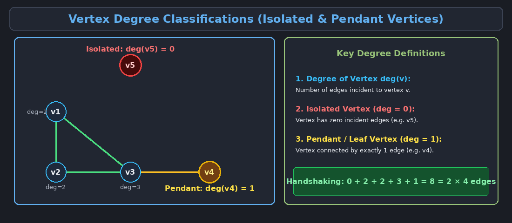
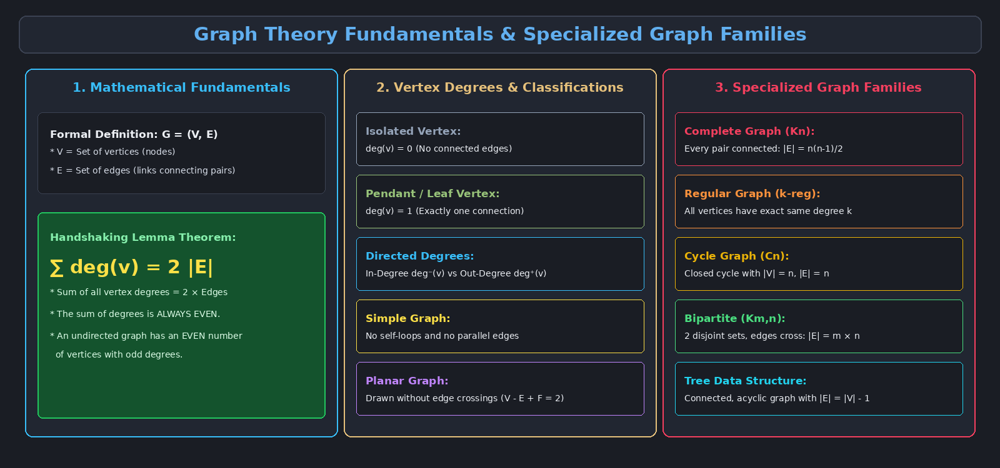
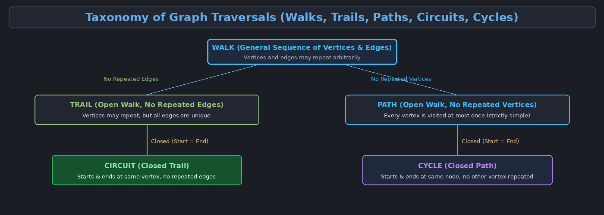

This topic introduces the foundational principles of algorithm design and provides a comprehensive study of Graph Theory fundamentals used to model complex relational data structures.

---

# 1. Introduction to Algorithms and Data Structures

An **algorithm** is any well-defined computational procedure that takes some value, or set of values, as input and produces some value, or set of values, as output. In essence, it serves as a sequence of computational steps that transform the input into the desired output.

> **Input Data** $\longrightarrow$ **Algorithm (Sequence of Steps)** $\longrightarrow$ **Output Result**

### Key Aspects of Algorithm Design

When analyzing and designing algorithms, computer scientists evaluate three critical aspects:

1. **Correctness of the Algorithm:**
   - An algorithm is deemed *correct* if, for every input instance, it halts with the correct output.
   - An *incorrect* algorithm might not halt at all on some input instances, or it might halt with an incorrect answer.

2. **Evaluating Different Solutions to the Same Problem:**
   - For almost every computational problem (e.g., sorting, searching, shortest path), multiple distinct algorithms exist.
   - We must compare algorithmic strategies (e.g., iterative vs. divide-and-conquer vs. greedy) to select the most suitable approach.

3. **Algorithmic Complexity (Resource Consumption):**
   - **Time Complexity:** How long does the algorithm take to execute as a function of the input size $n$?
   - **Space Complexity:** How much working memory (RAM) does the algorithm require during execution?

---

# 2. Graph Theory: Basic Concepts and Terminology

A **Graph** is a non-linear data structure used to model pairwise relations between objects. Graphs consist of a collection of points (vertices) interconnected by links (edges).

### Formal Mathematical Definition

Formally, a graph $G$ is an ordered pair:

$$G = (V, E)$$

- **$V$ (Vertex Set):** A non-empty set of elements called **vertices** or **nodes**.
- **$E$ (Edge Set):** A set of **edges** (links), where each edge connects a pair of vertices $(u, v) \in V \times V$.

*In the example graph above:*
- $V = \{a, b, c, d, e\}$ (5 vertices)
- $E = \{(a, b), (a, c), (b, d), (c, d), (d, e)\}$ (5 edges)

---

# 3. Classifications of Graphs

### 3.1 Directed vs. Undirected Graphs

| Feature | Undirected Graph | Directed Graph (Digraph) |
| :--- | :--- | :--- |
| **Edge Direction** | Edges are bidirectional / unordered pairs $\{u, v\}$. | Edges have direction / ordered pairs $(u, v)$ from tail $u$ to head $v$. |
| **Notation** | $(u, v)$ is identical to $(v, u)$. | $(u, v) \neq (v, u)$. |
| **Visuals** | Represented by simple lines. | Represented by arrows. |

### 3.2 Weighted vs. Unweighted Graphs
- **Unweighted Graph:** Every edge represents a simple binary connection (cost/weight = 1).
- **Weighted Graph:** Every edge $e = (u, v)$ is assigned a numerical value $w(u, v)$, representing costs, distances, travel times, or network capacities.

### 3.3 Simple Graphs vs. Multigraphs
- **Self-Loop:** An edge that connects a vertex to itself (i.e., $(u, u)$).
- **Parallel / Multiple Edges:** Two or more edges connecting the exact same pair of vertices.
- **Simple Graph:** An undirected graph that contains **no self-loops** and **no parallel edges**.

---

# 4. Vertex Degrees and Handshaking Lemma

The **degree** of a vertex $v$, denoted as $\deg(v)$, is the number of edges incident to $v$ (with self-loops counted twice).

- **Isolated Vertex:** A vertex with degree $0$ ($\deg(v) = 0$). It has no connected edges.
- **Pendant (Leaf) Vertex:** A vertex with degree $1$ ($\deg(v) = 1$).

### Degrees in Directed Graphs
In a directed graph, each vertex has two distinct degree measures:
- **In-Degree ($\deg^-(v)$):** The number of edges coming *into* vertex $v$.
- **Out-Degree ($\deg^+(v)$):** The number of edges going *out of* vertex $v$.
- **Total Degree:** $\deg(v) = \deg^-(v) + \deg^+(v)$.

---

### The Handshaking Lemma (First Theorem of Graph Theory)

> [!important] Theorem (Handshaking Lemma)
> In any undirected graph $G = (V, E)$, the sum of the degrees of all vertices is equal to twice the number of edges:
>
> $$\sum_{v \in V} \deg(v) = 2|E|$$

#### Corollaries:
1. The sum of degrees in any graph is always an **even number**.
2. An undirected graph always has an **even number of vertices with odd degrees**.

---

# 5. Specialized Graph Families

| Graph Type | Definition & Mathematical Properties | Example Notation / Formula |
| :--- | :--- | :--- |
| **Null Graph** | A graph containing only isolated vertices and zero edges ($E = \emptyset$). | $N_n$ (order $n$) |
| **Complete Graph** | A simple graph where every pair of distinct vertices is connected by a unique edge. | $K_n$, with $\|E\| = \frac{n(n-1)}{2}$ edges |
| **Regular Graph** | A graph where every vertex has the exact same degree $k$ ($k$-regular graph). | $k$-regular: $\|E\| = \frac{n \cdot k}{2}$ |
| **Cycle Graph** | A graph consisting of a single closed cycle containing $n$ vertices. | $C_n$, with $\|V\| = n, \|E\| = n$ |
| **Bipartite Graph** | A graph whose vertex set $V$ can be partitioned into two disjoint sets $V_1$ and $V_2$ such that every edge connects a vertex in $V_1$ to one in $V_2$. | Complete Bipartite $K_{m,n}$, with $\|E\| = m \cdot n$ |
| **Planar Graph** | A graph that can be drawn in a single geometric plane such that no two edges intersect. | Euler's Formula: $V - E + F = 2$ |

---

# 6. Walks, Trails, Paths, Circuits, and Cycles

Understanding how to traverse a graph is central to algorithmic problem solving.

- **Walk:** An alternating sequence of vertices and edges $v_0, e_1, v_1, e_2, \dots, v_k$. Vertices and edges may repeat.
- **Trail:** A walk in which **no edge is repeated**. (Vertices may repeat).
- **Path:** A trail in which **no vertex is repeated** (and consequently no edge is repeated).
- **Circuit:** A **closed trail** (starts and ends at the exact same vertex with no repeated edges).
- **Cycle:** A **closed path** (starts and ends at the exact same vertex, with no other repeated vertices).

---

# 7. Connectivity, Trees, and Spanning Trees

### 7.1 Graph Connectivity
- **Connected Graph:** An undirected graph where there is a path between every pair of vertices.
- **Disconnected Graph:** A graph composed of two or more isolated subgraphs called **connected components**.

### 7.2 Trees and Forests
A **Tree** is an undirected, connected simple graph that contains **no cycles** (acyclic).

> [!note] Properties of a Tree $T = (V, E)$ with $n$ vertices
> 1. $T$ is connected and contains no cycles.
> 2. $T$ has exactly $n - 1$ edges ($|E| = |V| - 1$).
> 3. There is a unique simple path between any two vertices in $T$.
> 4. Adding any single edge creates exactly one cycle.
> 5. Removing any edge disconnects the tree (every edge is a bridge).

A **Forest** is a disjoint collection of trees (an acyclic graph that is not necessarily connected).

### 7.3 Spanning Trees
A **Spanning Tree** of a connected graph $G = (V, E)$ is a subgraph that includes **all vertices** of $G$ ($V' = V$) and is a tree.
- For a graph with $|V| = n$ vertices, any spanning tree contains exactly $n - 1$ edges.

---

# 8. Real-World Applications of Graph Theory

1. **Computer Networks & Routing:** Modeling routers as vertices and physical/wireless links as weighted edges to find minimum-latency transmission paths.
2. **Social Networks:** Modeling users as vertices and friendships/follows as edges for community detection and influence analysis.
3. **Database Systems & Knowledge Graphs:** Using graph databases (e.g., Neo4j) to represent highly interconnected entities.
4. **Electronic Circuit Design:** Checking planarity of circuits to print non-overlapping conductive tracks on printed circuit boards (PCBs).
