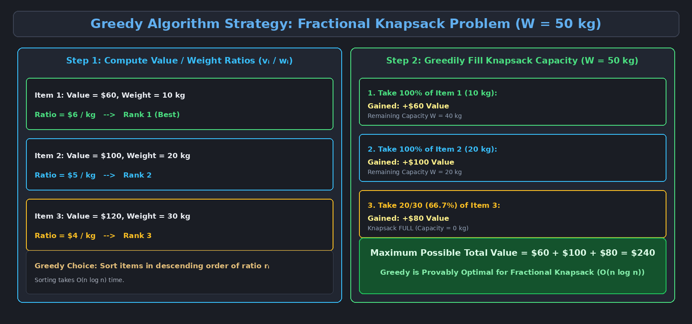

This topic covers the Greedy algorithmic paradigm, elements of greedy strategies, the Fractional Knapsack Problem, and the comparison between Greedy and Dynamic Programming approaches.

---

# 1. The Greedy Algorithmic Paradigm

A **Greedy Algorithm** solves optimization problems by making a sequence of choices. At each decision point, the algorithm makes the choice that looks **best at the moment** (a locally optimal choice) in the hope that this will lead to a globally optimal solution.

> [!important] Core Maxim of Greedy Strategy
> *"Make a locally optimal choice at each step in the hope of reaching a globally optimal solution."*

### Characteristics of Greedy Algorithms:
- **Myopic (Short-Sighted):** Greedy algorithms never reconsider past decisions or backtrack.
- **Top-Down Decision Making:** The algorithm makes a greedy choice before solving any subsequent subproblems.
- **Efficiency:** Greedy algorithms are typically very fast, usually running in $O(n)$ or $O(n \log n)$ time.

---

# 2. Key Elements of the Greedy Strategy

A problem must possess two fundamental mathematical properties for a greedy algorithm to guarantee an optimal global solution:

### 2.1 The Greedy-Choice Property
- A globally optimal solution can be arrived at by making **locally optimal (greedy) choices**.
- We can make a choice based on what is currently best without waiting for the results of subproblems.

### 2.2 Optimal Substructure
- A problem exhibits **Optimal Substructure** if an optimal solution to the overall problem contains within it optimal solutions to its subproblems.
- After making a greedy choice, we are left with a subproblem of the same form.

---

# 3. Greedy vs. Dynamic Programming (DP)

| Feature | Greedy Algorithms | Dynamic Programming (DP) |
| :--- | :--- | :--- |
| **Choice Timing** | Makes choice *before* solving subproblems (Top-down). | Solves subproblems *first*, then makes optimal choice (Bottom-up). |
| **Backtracking** | Never backtracks or changes past choices. | Explores all possible subproblem combinations. |
| **Complexity** | Typically faster ($O(n)$ or $O(n \log n)$). | Slower ($O(n^2)$, $O(n W)$, polynomial). |
| **Applicability** | Only works when greedy choice property holds. | Works on a broader range of optimization problems. |

---

# 4. The Fractional Knapsack Problem

A thief robbing a store finds $n$ items. Item $i$ has a value $v_i$ and weight $w_i$. The thief carries a knapsack with maximum weight capacity $W$. 

In the **Fractional Knapsack** version, the thief can take **fractions** of items (e.g., $x_i \in [0, 1]$ of item $i$, taking weight $x_i \cdot w_i$ and gaining value $x_i \cdot v_i$).

- **Item 1:** Value = $60, Weight = 10 kg ($6 / kg)
- **Item 2:** Value = $100, Weight = 20 kg ($5 / kg)
- **Item 3:** Value = $120, Weight = 30 kg ($4 / kg)
- **Knapsack Capacity:** $W = 50$ kg

### 4.1 Greedy Strategy (Value-to-Weight Ratio):
1. Compute the **value-per-unit-weight ratio** for each item:

$$r_i = \frac{v_i}{w_i}$$

2. Sort all items in **descending order** of their ratio $r_i$.
3. Greedily fill the knapsack by taking as much of the highest-ratio item as possible until capacity $W$ is exhausted.

### 4.2 Step-by-Step Example Walkthrough:
- **Sort Items by Ratio:**
  - Item 1: $\frac{60}{10} = \$6/\text{kg}$
  - Item 2: $\frac{100}{20} = \$5/\text{kg}$
  - Item 3: $\frac{120}{30} = \$4/\text{kg}$
- **Greedy Filling ($W = 50\text{kg}$):**
  - Take all of Item 1: $10\text{kg} \implies \text{Value } +\$60$ (Remaining $W = 40\text{kg}$).
  - Take all of Item 2: $20\text{kg} \implies \text{Value } +\$100$ (Remaining $W = 20\text{kg}$).
  - Take $\frac{20}{30}$ fraction of Item 3: $20\text{kg} \implies \text{Value } +\$80$ (Remaining $W = 0\text{kg}$).
- **Total Max Value:** $\$60 + \$100 + \$80 = \$240$.

$$\text{Time Complexity: } O(n \log n) \text{ (dominated by the sorting step)}$$

---

# 5. Fractional Knapsack vs. 0-1 Knapsack Problem

| Knapsack Variant | Fractional Knapsack | 0-1 Knapsack |
| :--- | :--- | :--- |
| **Item Division** | Can take fractions of items ($x_i \in [0, 1]$) | Must take the whole item or none ($x_i \in \{0, 1\}$) |
| **Optimal Paradigm** | **Greedy Algorithm** ($O(n \log n)$) | **Dynamic Programming** ($O(n W)$) |
| **Greedy Status** | **Provably Optimal** | **Greedy Strategy FAILS** |

> [!warning] Why Greedy Fails for 0-1 Knapsack
> In the **0-1 Knapsack Problem**, items cannot be divided ($x_i \in \{0, 1\}$). If we greedily take the highest ratio item, we might leave empty capacity in the knapsack that cannot be filled by remaining large items, resulting in a suboptimal total value. Therefore, 0-1 Knapsack requires **Dynamic Programming** ($O(n W)$) rather than a greedy strategy.
