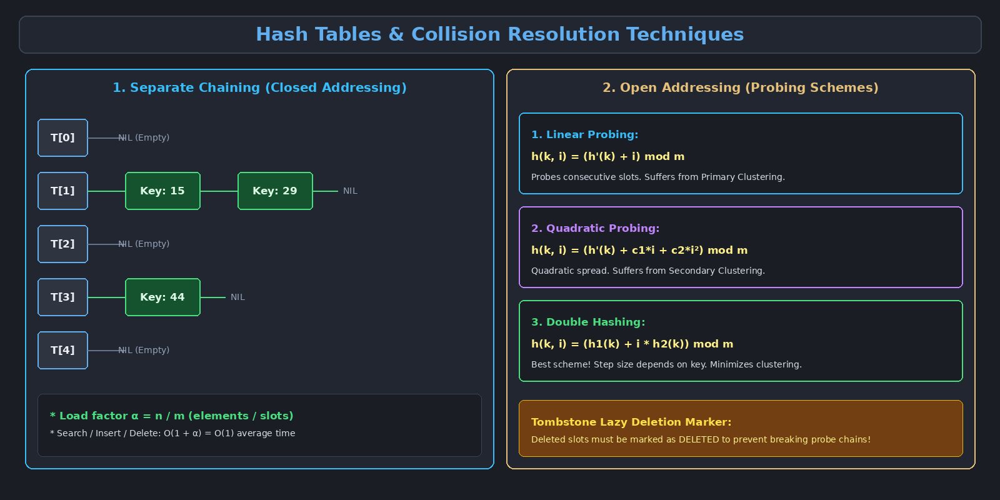

This topic covers search methodologies, Direct-Address Tables, Hash Tables, mathematical Hash Functions, and collision resolution via Separate Chaining and Open Addressing techniques.

---

# 1. Evolution of Search Techniques

| Data Structure / Strategy | Search Time (Average) | Search Time (Worst Case) | Space Required |
| :--- | :--- | :--- | :--- |
| **Unsorted Array / Linked List** | $O(n)$ | $O(n)$ | $O(n)$ |
| **Sorted Array (Binary Search)** | $O(\log n)$ | $O(\log n)$ | $O(n)$ |
| **Balanced BST / B-Tree** | $O(\log n)$ | $O(\log n)$ | $O(n)$ |
| **Direct-Address Table** | $O(1)$ | $O(1)$ | $O(\|U\|)$ (Huge space wastage) |
| **Hash Table** | $O(1)$ | $O(n)$ | $O(m)$ (Space-efficient) |

---

# 2. Direct-Address Tables

When the universe of possible keys $U = \{0, 1, \dots, u-1\}$ is small and distinct, we can use a **Direct-Address Table** where each key $k$ maps directly to array slot $T[k]$.

### Limitations of Direct Addressing:
1. **Memory Explosion:** If keys are 32-bit integers, $U = 2^{32} \approx 4.3 \text{ billion}$ slots, requiring gigabytes of RAM even if we only store 10 elements.
2. **Extreme Sparsity:** If $|K| \ll |U|$, most allocated slots remain `NIL`, wasting vast amounts of memory.

---

# 3. Hash Tables & Hash Functions

A **Hash Table** allocates an array of size $m$, where $m \ll |U|$. A mathematical **Hash Function** $h$ maps keys into slots:

$$h : U \to \{0, 1, \dots, m - 1\}$$

### 3.1 Common Hash Functions:

1. **The Division Method:**

$$h(k) = k \bmod m$$

   - *Best Practice:* Choose $m$ as a prime number not close to an exact power of $2$ or $10$.

2. **The Multiplication Method:**

$$h(k) = \lfloor m (k A \bmod 1) \rfloor \quad \text{where } 0 < A < 1$$

   - Multiply key $k$ by a constant fraction $A$, extract the fractional part $(k A \bmod 1)$, multiply by $m$, and take the floor.
   - *Knuth's Golden Ratio Constant:* $A \approx \frac{\sqrt{5} - 1}{2} \approx 0.6180339887$.

3. **Universal Hashing:**
   - Select a hash function *at random* from a carefully designed mathematical family of hash functions at runtime. This prevents malicious attackers from crafting adversarial worst-case $O(n)$ input sets.

4. **Perfect Hashing:**
   - A two-level hashing architecture providing guaranteed **$O(1)$ worst-case search time** for static sets of keys.

---

# 4. Collisions & The Pigeonhole Principle

Since the universe of keys $|U|$ is significantly larger than the hash table capacity $m$ ($|U| > m$), by the **Pigeonhole Principle**, two distinct keys will inevitably map to the exact same table index ($h(k_1) = h(k_2)$ for $k_1 \neq k_2$). This is called a **Collision**.

---

# 5. Separate Chaining (Closed Addressing)

In **Separate Chaining**, each slot $T[j]$ in the hash table contains a pointer to a singly linked list storing all records that hash to index $j$.

### Load Factor ($\alpha$) & Performance Analysis:

$$\text{Load Factor } \alpha = \frac{n}{m} \quad \left(\frac{\text{Total Stored Elements}}{\text{Total Table Slots}}\right)$$

- **Under Simple Uniform Hashing:** Any key is equally likely to hash to any of the $m$ slots.
- **Unsuccessful Search Time:** $\Theta(1 + \alpha)$
- **Successful Search Time:** $\Theta(1 + \alpha)$
- If the table size is kept proportional to the number of elements ($n = O(m) \implies \alpha = O(1)$), searching, inserting, and deleting all execute in **$O(1)$ average time**.

---

# 6. Open Addressing (Probing Techniques)

In **Open Addressing**, all keys reside directly inside the table array without linked lists. 
- Requirement: Table size must exceed or equal stored keys ($m \ge n \implies \alpha \le 1$).
- When a collision occurs, the algorithm calculates a systematic **probe sequence** $h(k, i)$ for $i = 0, 1, 2, \dots, m-1$ until an empty slot is located:

1. **Linear Probing:** $h(k, i) = (h'(k) + i) \bmod m$
2. **Quadratic Probing:** $h(k, i) = (h'(k) + c_1 i + c_2 i^2) \bmod m$
3. **Double Hashing:** $h(k, i) = (h_1(k) + i \cdot h_2(k)) \bmod m$

### 6.1 Linear Probing
- Checks consecutive slots: $h'(k), h'(k)+1, h'(k)+2, \dots$
- **Major Issue (Primary Clustering):** Occupied slots form long contiguous blocks. Long blocks increase the probability of future collisions, severely degrading search efficiency.

### 6.2 Quadratic Probing
- Probes slots using a quadratic offset: $h'(k) + c_1 i + c_2 i^2$.
- Eliminates primary clustering, but suffers from **Secondary Clustering** (keys with the same initial hash $h'(k)$ follow identical probe trajectories).

### 6.3 Double Hashing
- Utilizes two independent auxiliary hash functions $h_1(k)$ and $h_2(k)$.
- The step size depends dynamically on the key itself ($h_2(k)$), generating $m^2$ distinct probe sequences and providing performance closest to ideal uniform hashing.
- *Requirement:* $h_2(k)$ must be relatively prime to $m$ (e.g., $m$ is prime and $h_2(k) = 1 + (k \bmod (m-1))$).

---

### Deletion in Open Addressing (Tombstones)
When an element is deleted from an open-addressed table, its slot **cannot simply be set to `NIL`**. Setting it to `NIL` would prematurely terminate searches for other elements placed further down the probe chain.

> [!important] Lazy Deletion Marker
> The deleted slot must be marked with a special flag called a **Tombstone (`DELETED`)**. During searching, `DELETED` slots are treated as occupied (probing continues), while during insertion, `DELETED` slots can be overwritten.

---

# 7. Summary of Hash Table Applications
- **Compilers & Interpreters:** Symbol tables for identifiers and variable lookups.
- **In-Memory Caching:** High-speed key-value caches (Redis, Memcached).
- **Database Indexing:** Hash-join operators and hash indexes for point queries.
- **Cryptography & Security:** Password hashing (bcrypt, SHA-256) and data integrity checksums.
