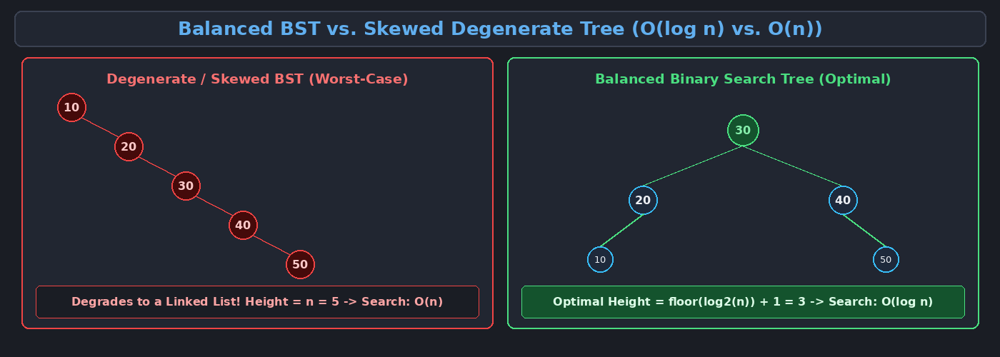
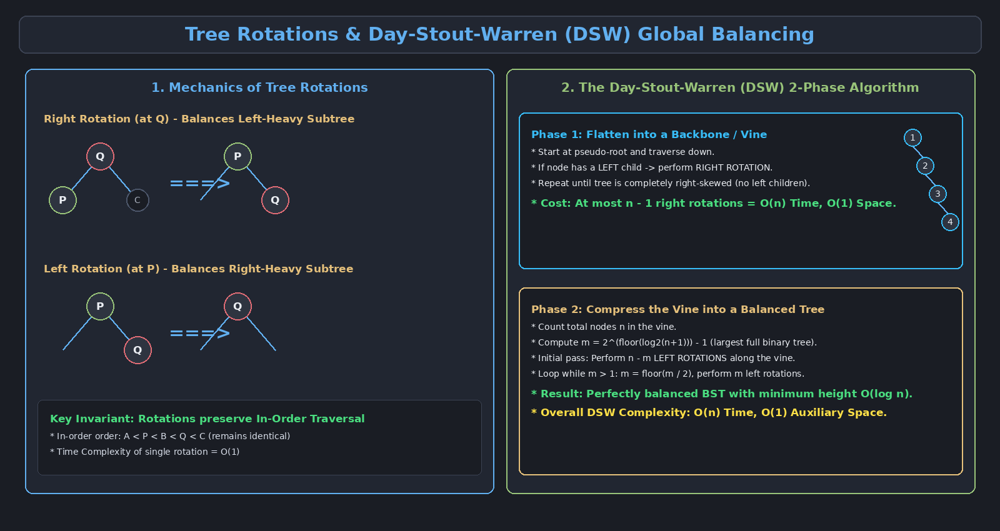

This topic explores Binary Search Trees (BST), tree degenerate states, tree rotation mechanics, and the complete Day-Stout-Warren (DSW) global balancing algorithm.

---

# 1. Binary Search Trees (BST) Fundamentals

A **Binary Search Tree (BST)** is a binary tree data structure where each node satisfies the binary search invariant:

$$\text{All Keys in Left Subtree} < \text{Node's Key} < \text{All Keys in Right Subtree}$$

### Standard Operations and Complexity:

| Operation | Balanced BST | Skewed / Degenerate BST (Worst Case) |
| :--- | :--- | :--- |
| **Search** | $O(\log n)$ | $O(n)$ (Degrades to Linked List) |
| **Insertion** | $O(\log n)$ | $O(n)$ |
| **Deletion** | $O(\log n)$ | $O(n)$ |
| **Traversals** | $O(n)$ | $O(n)$ |

### In-Order Traversal Invariant
Performing an **In-Order Traversal** (Left $\to$ Root $\to$ Right) on any valid BST always visits all elements in strictly **sorted ascending order**.

---

# 2. Deletion in a Binary Search Tree

Deleting a node from a BST requires handling three distinct topological cases:

1. **Case 1: Deleting a Leaf Node (0 Children):**
   - Simply remove the node and set the parent's pointer to `null`.
2. **Case 2: Deleting a Node with 1 Child:**
   - Bypass the node: link the parent directly to the single child of the deleted node.
3. **Case 3: Deleting a Node with 2 Children:**
   - Find the node's **In-Order Successor** (smallest node in the right subtree) or **In-Order Predecessor** (largest node in the left subtree).
   - Copy the successor's key into the target node.
   - Recursively delete the successor node (which is guaranteed to fall into Case 1 or Case 2).

---

# 3. The Need for Tree Balancing

When keys are inserted into a BST in already sorted or nearly sorted order (e.g., inserting `10, 20, 30, 40, 50`), the tree becomes completely **skewed (degenerate)**.

### Global vs. Local Balancing Strategies:
- **Local Balancing (Self-Balancing Trees):** The tree automatically rebalances itself upon *every single* insertion or deletion (e.g., AVL Trees, Red-Black Trees).
- **Global Balancing (On-Demand Balancing):** The tree is allowed to grow arbitrarily and is periodically restructured into a perfectly balanced tree in batch mode (e.g., **DSW Algorithm**).

---

# 4. Tree Rotations

**Tree Rotations** are fundamental structural operations that change the local shape of a tree without violating or altering the In-Order sorting invariant.

### 4.1 Right Rotation (Clockwise)
- Used when a tree is left-heavy.
- The left child $P$ moves up to replace $Q$.
- $Q$ becomes the right child of $P$.
- The subtree $B$ (which is $> P$ and $< Q$) moves to become the left child of $Q$.

### 4.2 Left Rotation (Counter-Clockwise)
- Used when a tree is right-heavy.
- The right child $Q$ moves up to replace $P$.
- $P$ becomes the left child of $Q$.
- The subtree $B$ (which is $> P$ and $< Q$) moves to become the right child of $P$.

---

# 5. The Day-Stout-Warren (DSW) Algorithm

The **DSW Algorithm** balances an arbitrary, highly unbalanced binary search tree of $n$ nodes in **$O(n)$ time** and **$O(1)$ auxiliary space** using in-place rotations.

---

## Phase 1: Creating a Backbone (Vine)

**Objective:** Flatten the arbitrary BST into a 1-dimensional, right-skewed linked list called a **Vine (Backbone)**, where every node has only a right child and zero left children.

### Phase 1 Algorithm:
1. Initialize a pseudo-root whose right child points to the actual tree root.
2. Maintain a pointer `tail` (starting at pseudo-root) and `rest` (starting at `tail.right`).
3. While `rest != null`:
   - If `rest` has a **left child**, perform a **Right Rotation** at `rest`. Update `rest` to the new root of this rotated subtree.
   - If `rest` has **no left child**, advance `tail` to `rest` and `rest` to `rest.right`.

> **Phase 1 Cost:** At most $n - 1$ right rotations $\implies$ Time Complexity $= O(n)$.

---

## Phase 2: Compressing the Vine into a Balanced Tree

**Objective:** Transform the linear right-skewed vine into a balanced BST by executing stages of left rotations.

### Phase 2 Algorithm & Mathematical Derivation:
1. Count the total number of nodes $n$ in the vine.
2. Calculate $m$, the maximum number of nodes in the largest full binary tree that can fit within $n$:

$$m = 2^{\lfloor \log_2(n+1) \rfloor} - 1$$

3. **Initial Compression Stage:** Perform $n - m$ Left Rotations along the vine on every other node starting from the root.
4. **Iterative Compression Stages:**
   - While $m > 1$:
     - $m = \lfloor m / 2 \rfloor$
     - Perform $m$ Left Rotations along the vine on alternating nodes.

> [!important] DSW Complexity
> - **Total Time Complexity:** $O(n)$
> - **Auxiliary Space Complexity:** $O(1)$ (in-place pointer restructuring)

---

# 6. Introduction to Multiway Search Trees

A **Multiway Search Tree (m-way tree)** generalizes binary search trees by allowing nodes to store up to $m-1$ keys and branch out to $m$ children.

- Multiway trees dramatically reduce the overall height of the tree, laying the foundation for **B-Trees** and disk-optimized database indexing structures.
